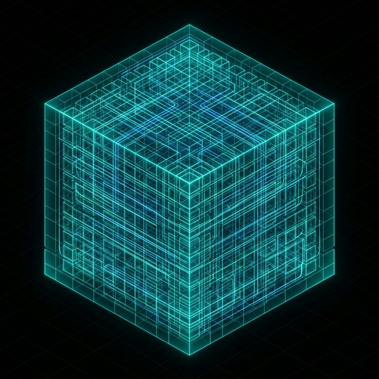
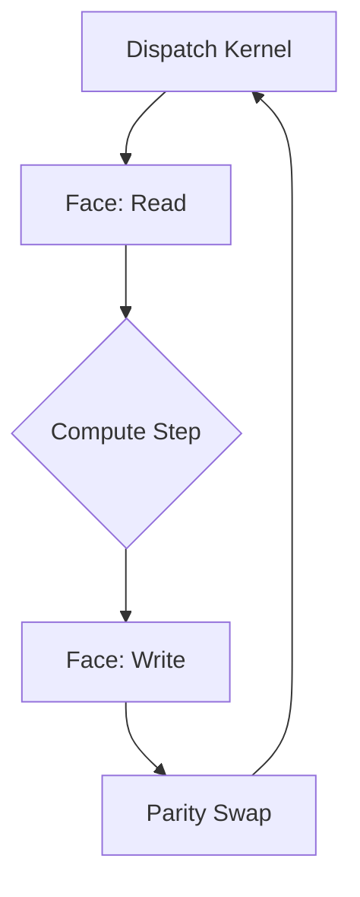

# 🏛️ Manifeste Architectural & Certification Noyau
**From $O(1)$ SAT Optimization to a Universal Multi-Physics Orchestrator.**

## 1. The "Data-First" Genesis
The Hypercube project was not born as a physics engine, but as a challenge in **computational complexity**. The initial objective was the implementation of **Summed Area Tables (SAT)** in $O(1)$ constant time for massive data structures.

To achieve $O(1)$ regional summation on GPU, we had to move away from standard nested loops and nested arrays. We discovered that a **unified, linear memory layout** was the only way to achieve maximum VRAM bandwidth efficiency. This discovery birthed the **MasterBuffer**.

---

## 2. Core Architectural Pillars

### 2.1 The MasterBuffer (The Memory Universe)
Contrary to game engines that store objects in lists, Hypercube treats space as a **continuous field**.
The `MasterBuffer` is a host-mirrored VRAM partition where every variable is mapped to a deterministic bit-offset.

*Visual representation of the unified data cube partitioned into compute chunks. IA generated image.*

- **Zero-Copy**: Cette consolidation assure que les couches de calcul sont isolées. On échange les pointeurs de "Face", pas les données.
- **Deterministic Alignment**: Chaque thread sait exactement quelle adresse mémoire frapper sans branchement conditionnel.

### 2.2 The GpuDispatcher (The Execution Brain)
The `GpuDispatcher` orchestrates the "Ping-Pong" parity rotation. For iterative solvers (LBM, FDTD), it is mathematically impossible to read and write to the same memory cell simultaneously without race conditions.

### 2.3 The Multi-Physics Convergence
By abstracting memory through the `VirtualGrid`, Hypercube can switch from a Navier-Stokes solver to a Maxwell Maxwell solver simply by changing the WGSL kernel. The engine remains agnostic; only the data contract (`p0-p7` parameters) and the memory layout matter.

---

## 3. Competitive Segment: Why Hypercube?
While libraries like **Cannon.js** or **Rapier** focus on *Rigid Body Dynamics* (collisions between discrete objects), **Hypercube** focuses on *Continuum Dynamics* (fields).

| Feature | Rigid Body Engines (Games) | Hypercube (Science) |
| :--- | :--- | :--- |
| **Target** | Collisions, Impulses | Fields, Gradients, Tensors |
| **Logic** | WASM/CPU Loops | WebGPU Compute Shaders |
| **Data** | Object Lists | Unified MasterBuffer |
| **Precision** | Narrative/Game-feel | Formal Scientific Audit |

---

## 4. Scaling: Multi-Chunk & Halo Exchange
To scale beyond a single GPU's memory limit, Hypercube implements **Halo Exchange**. Each computational chunk is surrounded by "Ghost Cells" that synchronize with their neighbors, allowing for a distributed "Virtual Grid" across massive domains.

---
*Hypercube GPU Framework — Integrity First — v4.7.0*
