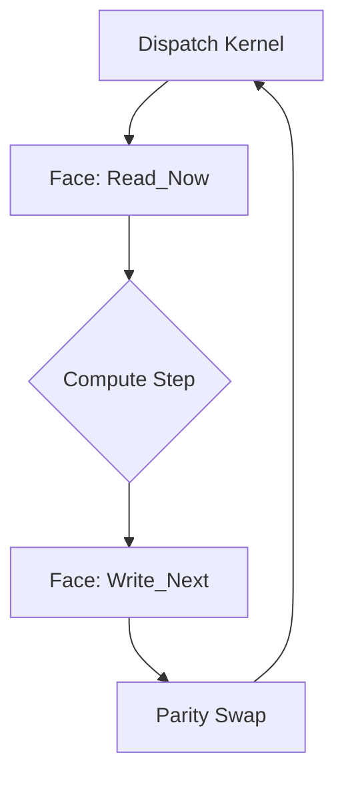

# 🏛️ Architectural Manifesto & Core Certification
## Hypercube v6.1 (Scientific Audit Node)

**From O(1) SAT Optimization to a Universal Multi-Physics Orchestrator.**

---

## 1. The "Data-First" Genesis
The Hypercube project was born not as a physics engine, but as a challenge in **computational complexity**. The initial objective was the implementation of **Summed Area Tables (SAT)** in $O(1)$ constant time for massive data structures.

To achieve $O(1)$ regional summation on GPU, we transitioned from standard nested arrays to a **unified, linear memory layout**. This discovery birthed the **MasterBuffer**.

---

## 2. Core Architectural Pillars

### 2.1 The MasterBuffer (The Memory Universe)
Contrary to traditional game engines that store objects in lists, Hypercube treats space as a **continuous field**. 
The `MasterBuffer` is a host-mirrored VRAM partition where every variable is mapped to a deterministic bit-offset.

- **Zero-Copy**: This consolidation ensures that compute layers are isolated. Memory "Faces" are exchanged via pointers (offsets), not data copies.
- **Deterministic Alignment**: Every thread calculates its memory address without branch divergence, maximizing VRAM bandwidth.

### 2.2 The GpuDispatcher (The Execution Brain)
The `GpuDispatcher` orchestrates the **Parity Rotation** (Ping-Pong). For iterative solvers (LBM, FDTD), it is mathematically impossible to read and write to the same memory cell simultaneously without race conditions.

### 2.3 The Multi-Physics Convergence
By abstracting memory through the `VirtualGrid`, Hypercube can switch solvers (Navier-Stokes, Maxwell, Diffusion) simply by changing the WGSL kernel. The engine is physics-agnostic; it only enforces the **Data Contract** and the memory layout.

---

## 3. Comparative Advantage: Why Hypercube?
While libraries like **Cannon.js** or **Rapier** focus on *Rigid Body Dynamics* (collisions between discrete objects), **Hypercube** focuses on *Continuum Dynamics* (fields).

| Feature | Rigid Body Engines (Games) | Hypercube (Science) |
| :--- | :--- | :--- |
| **Data Target** | Collisions, Impulses | Fields, Gradients, Tensors |
| **Logic Layer** | WASM/CPU Loops | WebGPU Compute Shaders |
| **Memory Model** | Object Lists | Unified MasterBuffer |
| **Precision** | Narrative/Game-feel | Formal Scientific Audit |

---

## 4. Performance & Zero-Readback Philosophy
The primary bottleneck in GPU computing is the **PCIe transfer** between VRAM and RAM. Hypercube is designed to eliminate this "CPU readback" whenever possible.

### 4.1 Digital Laboratory Rigor (Fast TDD)
Unit tests do not wait for GPU results. We use a **Uniform Audit** strategy:
- We mock the `GPUQueue.writeBuffer` method.
- We verify that the `GpuDispatcher` sends the correct **Face Indices** and **Physical Parameters** (omega, dt).
- If the dispatch contract is mathematically aligned, the physics *will* be correct on-device.

### 4.2 Zero-Copy Rendering
For 60 FPS visualization, developers should never use `getFaceData()` in the main loop. 
- **Direct GPU Access**: Use `engine.buffer.gpuBuffer` directly as a `STORAGE_BUFFER` in your Three.js or custom renderer.
- **Compute-to-Render**: Write a WGSL kernel that converts physical state (`rho`, `u`) into visual data (`color`, `positions`) directly in VRAM.

### 4.3 Asynchronous Synchronization
When readback is unavoidable (UI/AI), use `syncFacesToHost(['myFace'])`. It utilizes `mapAsync()` to prevent main-thread freezing while the GPU finishes its task.

---

*Hypercube Scientific Node — Integrity First — v6.1.0*
